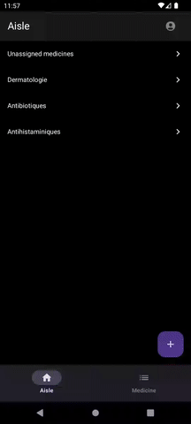
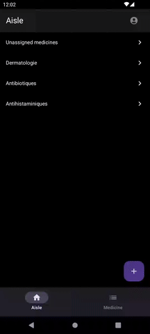
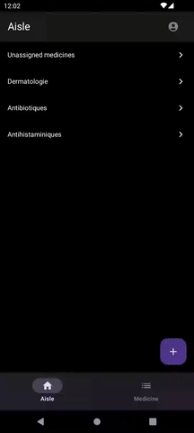
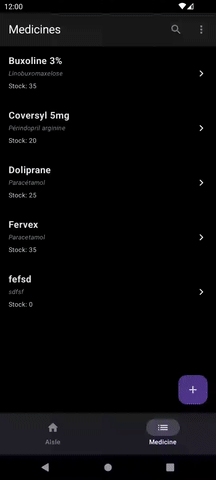
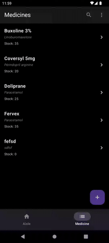

  

# Rebonnte App

Application Android de gestion de stock de médicaments pour le groupe pharmaceutique européen **Rebonnté**.

Développée en Kotlin avec **Jetpack Compose**, **Firebase** et une architecture moderne respectant les bonnes pratiques Android.

---

## 🚀 Présentation du projet

**Contexte** :  
Dans une démarche d'internalisation de ses outils, le pôle "Supply Chain" du groupe Rebonnté a souhaité développer une application Android pour remplacer un ancien système peu flexible. L'objectif est de disposer d'une application fiable pour la **gestion des stocks de médicaments**.

**Mission** :  
- Finaliser le développement existant.
- Corriger les bugs et respecter les standards d'architecture et de code.
- Mettre en place une solution CI/CD pour la livraison continue.
- Garantir la fiabilité de l'application sur l'ensemble de son cycle de vie.

---

## ⚙️ Fonctionnalités principales

- Création de compte utilisateur (authentification email/mot de passe via Firebase Authentication).
- Connexion et gestion sécurisée des sessions utilisateurs.
- Gestion des rayons de stockage.
- Gestion des médicaments par rayon.
- Suivi précis du stock de chaque médicament.
- Historique des modifications de stock.
- Intégration Firebase complète (auth, base de données, App Distribution).

---

## 📈 Tâches réalisées

| Étape | Objectifs | Résultats |
| :--- | :--- | :--- |
| **Clone du projet** | Récupération du projet GitHub | Projet ouvert et fonctionnel dans Android Studio |
| **Création projet Firebase** | Backend mobile | Projet nommé `GestionStockMedicaments`, application Android liée |
| **Configuration Firebase** | Authentification + Intégration | Auth email/password activée, app connectée |
| **Analyse du code et application** | Identification des bugs et améliorations | Listing structuré des correctifs |
| **Planification** | Organisation du travail | Planification sur Jira (Kanban board, Epic, Sprints, tickets, ...) |
| **Développement** | Corrections, améliorations, stabilisation | Application conforme aux attentes, bonnes pratiques respectées |
| **Mise en place CI/CD** | Déploiement continu | CI via GitHub Actions, distribution APK via Firebase App Distribution |

---

## 🛠️ Stack technique

- **Langage** : Kotlin
- **UI** : Jetpack Compose
- **Architecture** : MVVM
- **Backend** : Firebase Authentication / Firestore
- **CI/CD** : GitHub Actions + Firebase App Distribution
- **Suivi projet** : Jira

---

## 📸 Screenshots

| Sign Up | Medicines navigation | Aisles navigation |
|:---:|:---:|:---:|
|  |  |  |

| Add medicine | Delete medicine | Search medicine |
|:---:|:---:|:---:|
|  |  |  |

---

## 🎯 Résultat final

✅ Application fonctionnelle et conforme aux attentes.  
✅ Base de code assainie selon les standards Android / Kotlin.  
✅ Livraison continue assurée via CI/CD.

---

---
